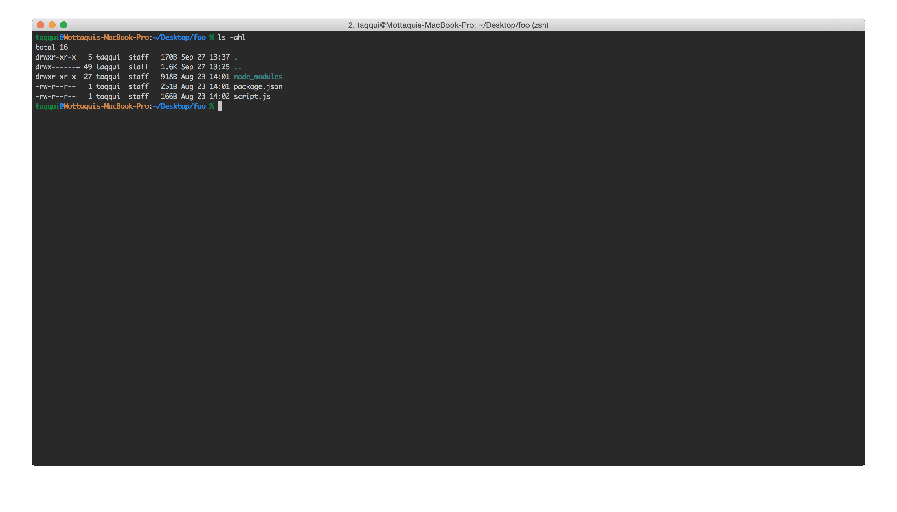

# GitTutor

GitTutor helps new git-users understand / remember the commands needed to initialize git, push to remote, etc

In other words, it will guide users through the steps needed to go from `git init` to `git commit`. 

## Installation

1. Pull down this repo. 
2. Navigate to downloaded folder in terminal and type `npm install -g`
3. Type in `gittutor` in terminal and you're good to go!

## In Action

## Todos

1. json for data 
2. args should be array (with multiple params)
3. tab completion...?
4. ability to hit enter to skip an entry
5. feedback in UI for stuff like ls commands
6. when completed, kill the process instead of forcing user to type quit
7. homepage
